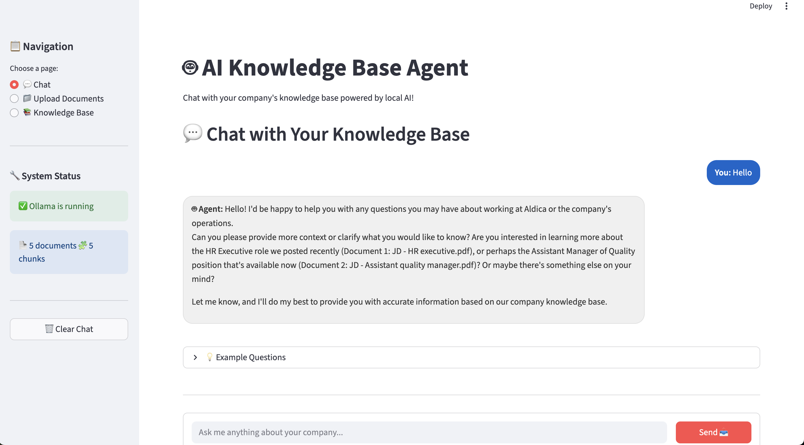

# AI Knowledge Base Agent

A local AI agent that can chat with your company's knowledge base using RAG (Retrieval-Augmented Generation). Built with Ollama for local LLM processing and Streamlit for the web interface.



## Features

- 🤖 **Local AI Processing** - Runs entirely on your machine using Ollama
- 📚 **Knowledge Base** - Upload and search through company documents
- 💬 **Chat Interface** - Web chat interface
- 📄 **Multi-format Support** - PDF, DOCX, TXT, and Markdown files
- 🔍 **Semantic Search** - AI-powered document search using vector embeddings
- 🔒 **Privacy First** - All data stays on your local machine

## Prerequisites

- Python 3.8 or higher
- At least 8GB RAM (for running local LLM)
- [Ollama](https://ollama.ai/) installed on your system

## Quick Start

### 1. Install Ollama

Visit [ollama.ai](https://ollama.ai/) and install Ollama for your operating system.

After installation, pull the required model:
```bash
ollama pull llama3.2
```

### 2. Clone and Setup the Project

```bash
# Clone the repository
git clone https://github.com/yourusername/ai-knowledge-agent.git
cd ai-knowledge-agent

# Create virtual environment
python -m venv agent-env

# Activate virtual environment
# On macOS/Linux:
source agent-env/bin/activate
# On Windows:
agent-env\Scripts\activate

# Install dependencies
pip install -r requirements.txt
```

### 3. Start Ollama Server

In a separate terminal, start Ollama:
```bash
ollama serve
```

Keep this terminal open while using the agent.

### 4. Run the Application

```bash
streamlit run streamlit_app.py
```

The application will open in your browser at `http://localhost:8501`

## Usage

### Upload Documents
1. Navigate to the "📁 Upload Documents" section
2. Drag and drop or select your company documents (PDF, DOCX, TXT)
3. Click "📤 Upload to Knowledge Base"

### Chat with Your Knowledge Base
1. Go to the "💬 Chat" section
2. Ask questions about your uploaded documents
3. Try example questions or type your own

### View Knowledge Base
1. Check the "📚 Knowledge Base" section to see uploaded documents
2. View document chunks and metadata

## Example Questions

Once you've uploaded documents, try asking:
- "What's our remote work policy?"
- "How many vacation days do employees get?"
- "What technologies do we use for backend development?"
- "What's our customer onboarding process?"

## How It Works

This agent uses **RAG (Retrieval-Augmented Generation)**:

1. **Document Processing**: Uploaded files are split into chunks and stored
2. **Vector Embeddings**: Each chunk is converted to mathematical vectors
3. **Semantic Search**: User questions find relevant document chunks
4. **AI Response**: Local LLM generates answers using found context

## Architecture

```
Streamlit App ←→ Ollama Server ←→ llama3.2 Model
      ↓
Knowledge Base (FAISS + SQLite)
```

## Troubleshooting

### Ollama Not Running
```bash
# Check if Ollama is running
curl http://localhost:11434

# If not running, start it:
ollama serve
```

### Import Errors
Make sure you're in the virtual environment:
```bash
# Check current environment
which python

# Should show path with 'agent-env'
```

### Memory Issues
If you encounter memory issues, try:
- Using a smaller model: `ollama pull llama3.2:1b`
- Reducing chunk size in `knowledge_agent.py`

## Customization

### Using Different Models
Edit `knowledge_agent.py` and change:
```python
self.model = "llama3.2"  # Change to your preferred model
```

### Adjusting Chunk Size
In `knowledge_agent.py`, modify:
```python
chunks = self.chunk_text(content, chunk_size=500, overlap=50)
```

## Contributing

1. Fork the repository
2. Create a feature branch
3. Make your changes
4. Submit a pull request

## License

MIT License - see LICENSE file for details

## Acknowledgments

- Built with [Ollama](https://ollama.ai/) for local LLM processing
- Uses [Streamlit](https://streamlit.io/) for the web interface
- Powered by [FAISS](https://github.com/facebookresearch/faiss) for vector search
- Document processing with [Sentence Transformers](https://www.sbert.net/)
